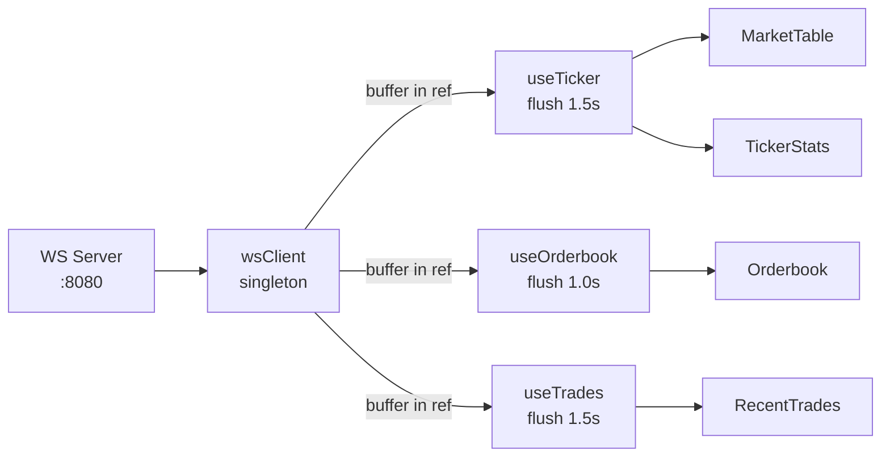

# Crypto Price Tracker

A real-time cryptocurrency price tracker.

---

## Setup

```bash
# 1. Start the mock WebSocket server (from the server directory)
cd socket-custom-load
bun install && bun start

# 2. In a separate terminal, start the frontend
cd crypto-price-tracker
npm install && npm start
```

App opens at **http://localhost:5173**

> The mock server runs on `ws://localhost:8080`. It needs to be running before the frontend starts.

---

## Approach

The core challenge is keeping the UI readable under a continuous stream of WebSocket messages arriving faster than humans can read.

**WebSocket singleton** — A plain module (`lib/wsClient.ts`) owns the single socket connection, tracks active subscriptions per channel, and handles exponential-backoff reconnection. All hooks share this one connection without React Context overhead.

**Batched updates** — Rather than calling `setState` on every incoming message (which would thrash the renderer), each hook buffers messages in a ref and flushes to React state on a fixed timer: ticker and trades every 1.5 s, orderbook every 1 s. This makes the UI readable and keeps CPU flat regardless of how fast the server sends — at 1 ms message intervals the hook batches hundreds of messages into a single `setState` call per flush.

**Symbol-tagged snapshots** — When navigating between symbols, the effect cleanup fires before the new effect starts. To avoid briefly showing stale data from the previous symbol during that gap, state is tagged `{ sym, data }` and the hook returns empty until the first flush for the new symbol arrives — no synchronous `setState` inside the effect body.

**Memoization** — `MarketRow`, `AskRows`, `BidRows`, and `TickerStats` are wrapped in `React.memo`. The ticker flushes new data for all 6 symbols every 1.5 s; without memo, every row would re-render on every flush. Stable per-symbol callback maps in `MarketTable` ensure the memo comparisons actually hold.

**CLS prevention** — All panels render their full structure from the first paint (placeholder dashes, not spinners). `<colgroup>` locks column widths so nothing shifts when live data replaces the skeletons.

---

## What I'd Improve With More Time

- **Error boundaries** — An uncaught render error currently takes down the whole app. Wrapping `DetailView` and `MarketTable` in error boundaries would give graceful fallbacks.
- **Web Worker for parsing** — At very high server frequencies, JSON parsing on the main thread competes with rendering. Moving `onmessage` parsing to a Worker would keep the main thread free.
- **Virtual scrolling** — The trades list caps at 20 rows today. A longer history would need `react-virtual` to avoid DOM bloat.
- **Environment config** — Server URL (`localhost:8080`) is hardcoded and should come from an env var (`VITE_WS_URL`).
- **Tests** — Custom hooks like `useTrades` and `useOrderbook` have non-trivial logic (batching, snapshot tagging) that would benefit from unit tests with a mocked `wsClient`.
- **Orderbook depth bars** — The current depth is a gradient behind the cumulative total cell. A dedicated full-row background bar (like most exchange UIs) would be more immediately readable.

---

## Architectural Flow



Messages arrive continuously from the server. Each hook buffers them in a ref and flushes to React state on a fixed interval — so the UI renders once per second regardless of server frequency.

---

## Architecture

### Project Structure

```
src/
├── components/
│   ├── ConnectionBadge.tsx   # header live/connecting indicator
│   ├── DetailView.tsx        # symbol detail layout (header + stats + panels)
│   ├── FavoriteButton.tsx    # star toggle button
│   ├── MarketRow.tsx         # single row in the market table (memoized)
│   ├── MarketTable.tsx       # market list with tabs, search, and loader
│   ├── Orderbook.tsx         # 10-level order book with depth bars
│   ├── RecentTrades.tsx      # scrolling trade feed with flash animation
│   ├── SearchBar.tsx         # controlled search input
│   └── TickerStats.tsx       # price hero with 24h stats (memoized)
├── hooks/
│   ├── useConnectionStatus.ts # subscribes to wsClient status changes
│   ├── useFavorites.ts        # localStorage-backed favorites set
│   ├── useOrderbook.ts        # throttled order book state (1 s flush)
│   ├── useTicker.ts           # batched ticker map (1.5 s flush)
│   └── useTrades.ts           # buffered trade feed with flash-clear (1.5 s flush)
├── lib/
│   └── wsClient.ts            # WebSocket singleton — connect, subscribe, retry
├── pages/
│   └── DetailPage.tsx         # route wrapper: validates symbol, passes props to DetailView
├── constants/
│   └── symbols.ts             # symbol list, names, and decimal precision
├── types/
│   └── ws.ts                  # TypeScript types for all WebSocket messages
└── utils/
    └── format.ts              # formatPrice, formatVolume, formatQty, formatTime
```

### Tech Stack

| Concern | Choice                |
| ------- | --------------------- |
| UI      | React 19 + TypeScript |
| Build   | Vite 8                |
| Routing | React Router v7       |
| Icons   | lucide-react          |
| Styles  | Plain CSS             |

### WebSocket Lifecycle

Two flat routes (`/` and `/:symbol`). Each route mounts its own `useEffect(() => { wsClient.connect() }, [])` — `connect()` is idempotent so calling it twice on navigation is safe. Every data hook registers a channel listener and a subscription in its effect, and removes both in the cleanup. Navigating between symbols re-triggers the `[symbol]`-dependent effects, cleanly unsubscribing the old symbol and subscribing the new one.
